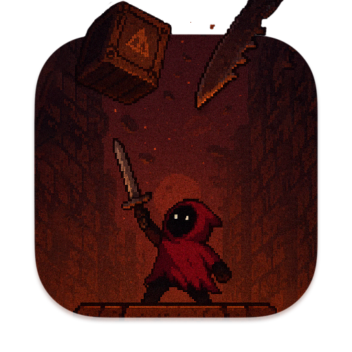

<div align="center">

# <picture><source media="(prefers-color-scheme: dark)" srcset="https://api.iconify.design/solar:gamepad-linear.svg?color=%2300F2FE"><source media="(prefers-color-scheme: light)" srcset="https://api.iconify.design/solar:gamepad-linear.svg?color=%230969DA"></picture> DODGE GAME
### **A Fast-Paced, Pixel-Art Dungeon Survival & Dodge Experience**

[](#)
[](#)
[](#)
[](#)

<br/>

<p align="center">
  <picture>
    <source media="(prefers-color-scheme: dark)" srcset="https://readme-typing-svg.demolab.com?font=Fira+Code&weight=600&size=20&pause=1000&color=00F2FE&center=true&vCenter=true&width=750&lines=Survive+the+Abyss:+Dodge+Falling+Dungeon+Hazards;Dynamic+Difficulty+Scaling+%26+Smooth+60+FPS+Physics;Custom-Built+Collision+Detection+%26+Score+Tracking;Clean+Object-Oriented+Architecture">
    <source media="(prefers-color-scheme: light)" srcset="https://readme-typing-svg.demolab.com?font=Fira+Code&weight=600&size=20&pause=1000&color=0969DA&center=true&vCenter=true&width=750&lines=Survive+the+Abyss:+Dodge+Falling+Dungeon+Hazards;Dynamic+Difficulty+Scaling+%26+Smooth+60+FPS+Physics;Custom-Built+Collision+Detection+%26+Score+Tracking;Clean+Object-Oriented+Architecture">
    
  </picture>
</p>

<p align="center">
  <b>An agile, custom-engineered pixel-art survival game built with clean object-oriented design, responsive physics, and escalating difficulty. How long can you survive the falling debris?</b>
</p>

</div>

---

## <picture><source media="(prefers-color-scheme: dark)" srcset="https://api.iconify.design/solar:play-stream-linear.svg?color=%2300F2FE"><source media="(prefers-color-scheme: light)" srcset="https://api.iconify.design/solar:play-stream-linear.svg?color=%230969DA"></picture> GAMEPLAY PREVIEW & OVERVIEW

<div align="center">
  <table>
    <tr>
      <td width="100%" align="center">
        <br/>
        
        <br/><br/>
        <p><i>Take control of your hooded hero and navigate a treacherous cavern. Dodge falling crates, spiked blades, and dungeon hazards as the pace relentlessly accelerates!</i></p>
      </td>
    </tr>
  </table>
</div>

> **Core Objective:** The premise is simple yet addicting—avoid incoming environmental hazards at all costs. As time progresses, falling velocity, spawn frequency, and trajectory unpredictability scale upward, putting your reflexes and spatial awareness to the ultimate test.

---

## <picture><source media="(prefers-color-scheme: dark)" srcset="https://api.iconify.design/solar:stars-linear.svg?color=%2300F2FE"><source media="(prefers-color-scheme: light)" srcset="https://api.iconify.design/solar:stars-linear.svg?color=%230969DA"></picture> KEY FEATURES & ARCHITECTURE

| Feature | Description | Engineering Highlights |
| :--- | :--- | :--- |
| ** Fluid 60+ FPS Movement** | Responsive, zero-latency player controls designed for precision dodging. | Implements optimized rendering loops and frame-rate independent delta-time movement. |
| ** Dynamic Difficulty Scaling** | The game dynamically ramps up hazard speed and spawn density over time. | Algorithmic progression system that continuously tests player reflexes without feeling unfair. |
| ** Precision Collision Engine** | Highly accurate hitbox evaluation ensuring fair gameplay and instant death triggers. | Custom bounding-box / bounding-circle collision mathematics optimized for low CPU overhead. |
| ** Score & State Tracking** | Persistent score tracking, high-score saving, and seamless game-state transitions. | Clean separation of concerns between menus, active gameplay, and game-over states. |

---

## <picture><source media="(prefers-color-scheme: dark)" srcset="https://api.iconify.design/solar:keyboard-linear.svg?color=%2300F2FE"><source media="(prefers-color-scheme: light)" srcset="https://api.iconify.design/solar:keyboard-linear.svg?color=%230969DA"></picture> CONTROLS & KEYBINDINGS

<div align="center">

| Action / Command | Primary Keybinding | Alternate Keybinding |
| :---: | :---: | :---: |
| **Move Up** | `<W>` | `▲ Up Arrow` |
| **Move Down** | `<S>` | `▼ Down Arrow` |
| **Move Left** | `<A>` | `◄ Left Arrow` |
| **Move Right** | `<D>` | `► Right Arrow` |
| **Pause / Resume** | `<ESC>` | `<P>` |
| **Restart Game** | `<R>` | `<Spacebar>` *(on Game Over)* |

</div>

---

## <picture><source media="(prefers-color-scheme: dark)" srcset="https://api.iconify.design/solar:rocket-linear.svg?color=%2300F2FE"><source media="(prefers-color-scheme: light)" srcset="https://api.iconify.design/solar:rocket-linear.svg?color=%230969DA"></picture> GETTING STARTED & INSTALLATION

Follow these instructions to clone the repository, install dependencies, and run the game locally on your machine.

### 1️⃣ Clone the Repository
```bash
git clone [https://github.com/Soheil-Aghayani/dodge-game.git](https://github.com/Soheil-Aghayani/dodge-game.git)
cd dodge-game
