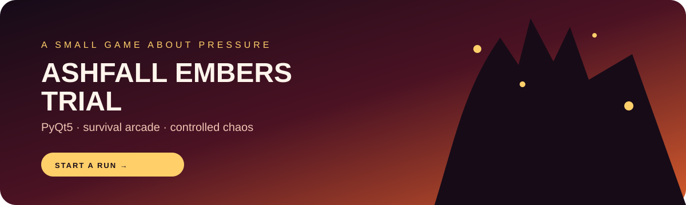

  

  <h1>ASHFALL EMBERS TRIAL</h1>
  
<strong>A PyQt5 survival arcade game about movement, pressure, and falling hazards.</strong>

  

    
    
    
  

---

## The idea

Ashfall Embers Trial is a compact desktop arcade experiment. You move through a hostile arena, survive falling blocks, react to abnormal events, and chase a higher score every run.

The project is deliberately tactile: cached rendering, sprite animation, sound effects, pause states, health, hazards, and a game-over loop all live inside a small PyQt5 application.

## The experience

- Main menu, gameplay, pause, settings, and restart flows
- Keyboard movement with responsive timing
- Falling blocks, collision detection, health, and high-score persistence
- Abnormal events such as reversed controls, a reversed floor, and random blocks
- Animated player states, particles, sound effects, and a custom game-over screen
- A modular module/ package so gameplay systems can evolve independently

## Run locally

~~~bash
python -m venv .venv
.venv\Scripts\activate
pip install PyQt5
python main.py
~~~

Use the arrow keys to move. Survive as long as possible, then press R to restart after a run.

## Project map

| Area | Responsibility |
| --- | --- |
| main.py | Application window and game loop |
| module/player.py | Player state, movement, and animation |
| module/block.py | Falling hazards and collision geometry |
| module/health_system.py | Damage, health, and game-over state |
| module/abnormal.py | Random rule changes and challenge events |
| module/asset/ | Sprites, sounds, fonts, and backgrounds |

## Why it is here

This is one of the account's playful engineering projects: a place to explore realtime rendering, stateful UI, performance-minded updates, and the small details that make a game feel alive.

  Built with Python, PyQt5, sprites, sound, and a little controlled chaos.

